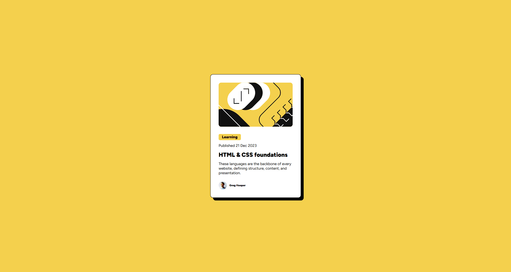

# Challenge Frontend Mentor
## Praticando o frontened

Neste exercício fiz o alinhamento dos itens dentro de um card sendo o container principal, como um preview de um card usando o flexbox.

Blog preview card de dificuldade newbie para reforçar meus conhecimentos, tive dificudades com largura mas alinhei-os corretamente no final.

Resultado:

Tecnologias utilizadas:
- HTML
- CSS